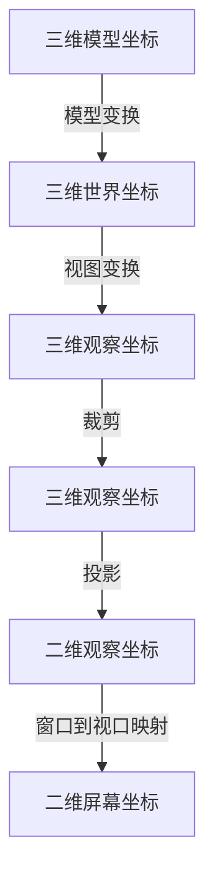

## 1. 三维几何和几何流水线
计算机图形系统通过创建**三维几何流水线**来处理三维几何数据，将三维对象转换成二维对象。


### 1.1 几何属性
#### 1 场景与视图
场景：在图像中显示的三维空间对象组合，包括场景中所有的几何对象与光照。（定义空间中的对象）
视图：用于创建图像的信息集，包括场景空间、场景坐标系、坐标系中带观察方向的视点、将空间中可视部分映射到二维可视平面的投影操作。（定义空间中的可视部分以及观察方式）

#### 2 三维模型坐标系
在定义几何体的过程（建模）中，每个对象的局部坐标系。

#### 3 三维世界坐标系
场景包括三维坐标系中的一系列图像，所有对象都属于该三维坐标系，称为世界坐标系。世界坐标系是场景中的客观存在，与观察者无关。

#### 4 三维观察坐标系
观察模型（视点或摄像机）通常指定的默认观察方向和视点，将视图变换应用到世界坐标系中就可得到三维观察坐标系。

#### 5 投影
投影即将三维观察坐标转换为二维坐标。投影将视域体映射成二维矩形，称为视平面。通常由两种投影：

1. 平行投影：将模型中所有点通过与 $Z$ 轴平行的方向投影到$X$-$Y$平面，即每一点保持$x$、$y$坐标而忽略了$z$坐标。平行投影中最常见的是正交投影，投影方向与$Z$轴平行。
2. 透视投影：将眼睛看做一个点，场景中的每个点沿着眼睛到该点的方向映射到视平面，透视投影有近大远小的效果。

在平行投影中使用正交视域体，呈立方体。在透视中使用透视视域体，呈截断四锥体。

#### 6 裁剪
视点无法观察到整个三维世界，故用三维视域体来定义场景中的可视部分。

#### 7 二维观察坐标
投影操作将三维观察坐标映射成二维空间坐标，定义观察者看到场景几何体的二维视图。

```
二维观察坐标的一个点相当于三维观察坐标中的一整条线，因此在投影时深度信息丢失了。对于平行投影，无法从对象的大小来判断深度信息。但是对于透视投影，还可根据投影到二维平面后对象的大小来判断原来大小相同二距离不同的对象在空间中的位置（近大远小）。

如果采用隐藏面剔除技术，还可以通过近处对象遮挡远处对象的原理来判断对象在空间中的位置。
```


#### 8 二维屏幕坐标
窗口映射到视口映射：将二维观察坐标映射到二维显示设备的坐标系中，显示在屏幕坐标上。

### 1.2 外观属性
正确生成一个图像不仅需要模型顶点坐标，还需要顶点的许多其他属性，如深度值、颜色、法向量、材质、纹理坐标等，这些外观属性在几何流水线中保持不变。
外观属性由绘制流水线操作处理，即几何属性映射到屏幕空间后绘制流水线再操作。
#### 1. 颜色
颜色可以自定义或者由光照模型计算得知。大部分图像API支持RGBA颜色系统：由RGB三原色通道和$\alpha$通道定义，$\alpha$通道用于绘图时物体与背景色的混合。

#### 2. 纹理
纹理映射可以将图像内容贴到模型上，是为场景添加视觉效果最有用的方法之一。

#### 3. 深度缓存
保存比较视点与已绘制像素的距离和待绘制像素的距离，可以达到近处对象遮挡远处对象的效果。如果待绘制像素到视点的距离小于已绘制像素，则新像素颜色覆盖原来的颜色，反之保留原来的颜色。


