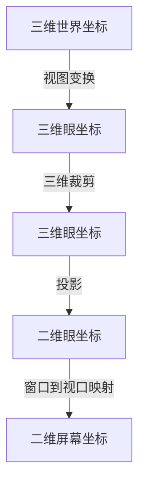

### 1.1 几何流水线
为了在计算机用图像表现场景，必须建立三维场景的二维表现形式。
首先为场景建立一系列的模型，并将模型放到场景中，这样在世界空间就有了一系列的物体。然后定义观看场景的方式和视图在屏幕上显示的方式，完成相应的变换。

从三维世界空间到二维屏幕空间的流水线：

### 1.2 视图变换的基本模型
视图变换需要的“物理模型”：视点、视图参考点、视域体。
在世界空间里确定视点相当于定义眼坐标系，从而定义了视图中所有物体从世界坐标系转化到眼坐标系的变换。该变换建立一个从世界坐标系到眼坐标系的基本变换矩阵并把它应用到场景中所有物体。这个变换把视点放在原点，看向 $Z$ 轴方向，同时 $Y$ 轴是向上方向，称为视图变换。
视图变换完成后，几何流水线下一步骤就可以将几何模型投影到观察平面上。投影完成后，就着手计算把物体映射到显示空间上。

### 1.3 定义
#### 1.3.1 建立视图环境
为了将视点摆放到标准位置，要把世界空间通过视图变换变道另一个三维空间中，这个三维空间需要定义三个关键元素：视点、眼睛看的方向、眼睛的垂直方向。
在OpenGL中，建模在右手坐标系，整个场景中的几何模型变换到以视点为原点的坐标系中时的变换是左手坐标系，视点看向 $Z$ 轴的负方向。
![[Pasted image 20231214211406.png]]

定义视图所需的信息：
- 视点位置的 $(x,y,z)$ 坐标
- 视点看向的方向，该方向将成为眼坐标系的 $Z$ 方向
- 在世界空间中视点向上的方向，该方向将成为眼坐标系的 $Y$ 方向

视图变换的关键是旋转世界空间，使向上方向和 $Y$ 轴方向一致，视线方向与 $Z$ 轴负方向一致，然后移动世界空间，将视点位置移动到原点，最后缩放世界空间，使得目标点或目标向量的值是 $(0,0,-1)$ 。

#### 1.3.2 定义投影
视图变换后到三维眼空间还不能在设备上显示图像，必须要把场景映射到和显示设备对应的二维空间。要完成这一步需要投影操作。
常用投影有正交投影和透视投影。

1. 正交投影
正交投影会忽视 $Z$ 坐标只考虑 $X$ 和 $Y$ 坐标，因此物体无论离眼睛远近都是原来的大小。如果点 $(x,y,z)$ 映射到点 $(x',y')$ ，那么 $x'=x$ 且 $y'=y$ 。

透视投影将每一个点都映射到三维眼空间 $Z=1$ 的平面上，是点和原点连线与 $Z=1$ 平面的交点，因此二维眼空间中的每个点都表示三维眼空间的一条直线。如果点 $(x,y,z)$ 映射到点 $(x',y')$ ，则通过相似三角形可得 $x'=x/z$ 且 $y'=y/z$ 。
![[Pasted image 20231214212459.png]]

投影变换时 $Z$ 坐标信息应该被保留以便进行深度测试或者透视校正纹理的计算。

#### 1.3.3 视域体
视域体是指包含所有三维空间经过投影后可以看到的物体的空间。正交投影的视域体是一个矩形体，透视投影的视域体是一个棱锥台体。
![[Pasted image 20231214212813.png]]

#### 1.3.4 正交投影
要定义正交投影，必须指定视域体的上下、左右、远近平面，每个平面定义格式如下：
 $$coordinate(坐标)=value(值)$$
每个平面都用一个实数定义。

#### 1.3.5 透视投影
透视投影需要定义视域体的观察范围角（FOV）、高宽比（Aspect）、远近平面。因为透视投影视域体的远端比近端大，所以投影到窗口后会有远小近大的效果。透视投影有一点透视、两点透视、三点透视。
![[Pasted image 20231214213456.png]]

#### 1.3.6 透视投影的计算
我们已经知道，根据三角形理论可得投影后的点 $x'=x/z$ 以及 $y'=y/z$ ，所以透视投影就是在三维空间中把 $x$ 和 $y$ 坐标都除以 $z$ ，故投影矩阵如下：
$$\begin{bmatrix}1/z&0&0\\0&1/z&0\\0&0&1\end{bmatrix}$$
这个矩阵定义了从三维空间到二维空间的变换，称为透视变换。如果要严格投影到二维空间可以把最后一列消去。

#### 1.3.7 视域体裁剪
在场景进行显示之前，要将视域体之外的图像进行裁剪。
- 对于正交投影的裁剪：只需判断直线是否在  $X=Xleft,X=Xright,Y=Ybottom,Y=Ytop,Z=Znear,Z=Zfar$  平面上，然后进行裁剪。
- 对于透视投影：为了避免对透视视域体的倾斜平面进行裁剪，可以先进行透视变换使得透视视域体的倾斜平面与 $Z$ 轴平行，然后再进行裁剪计算。

#### 1.3.8 定义窗口和视口
投影后的场景在二维眼空间中，为了创建图像需要把几何数据从二维眼坐标系转化为整数值的离散坐标系。这需要区分离散的屏幕点和替换数值的几何点，并引入采样问题，图形API会处理这些事。

对图形API来说，窗口是观察空间的一个矩形区域，在这个区域里进行具体的绘制。此外图形API提供绘图窗口与显示设备窗口的接口，绘图窗口中的空间称为屏幕空间，用于在几何流水线中描述二维平面坐标，屏幕空间中使用的最小显示单位是像素。

几何流水线的最后一步变换即二维眼坐标系到二维屏幕坐标系的变换，即，点要从二维眼空间的一个矩形区域变换到二维屏幕空间的一个矩形区域。

例：下图显示二维窗口与视口。在左边的二维窗口中，$X$ 最小值是 $XMIN$ ， 最大值是 $XMAX$， $Y$ 最小值是 $YMIN$， $Y$ 最大值是 $YMAX$ 。在右边的视口中，$X$ 最小值是 $L$ ，最大值是 $R$ ，$Y$ 最小值是 $B$ ，最大值是 $T$ 。

![[Pasted image 20231225140347.png]]

则窗口的高度 $WW$ 与高度 $WH$ 为：

$$WW=XMAX-XMIN, WH=YMAX-YMIN$$

视口的宽度 $VW$ 与高度 $VH$ 分别为：

$$VW=R-L,VH=T-B$$

由矩形的对比关系可以得到：

$$\begin{aligned}(x-XMIN)/WW=(u-L)/VW\\(y-YMIN)/WH=(v-B)/VH\end{aligned}$$

通过这两个不等式，给定任意一对值可以解出对应的另外一对值，即给的窗口中的 $(x,y)$ 可以解出视口中的 $(u,v)$ ：

$$\begin{aligned}u=L+(x-XMIN)*VW/WW\\v=B+(y-YMIN)*VH/WH\end{aligned}$$

同理，给出视口中的 $(u,v)$ 可以解出窗口中的 $(x,y)$ 的值。

### 1.4 管理视图的其他方面
#### 1.4.1 隐藏面
大部分图形系统可以使用场景中几何的深度信息来决定哪些物体是离得最近的，并且只绘制物体的前面部分，这个技术称为深度缓冲。如果深度信息基于场景中的 $z$ 坐标，也称为 $z$ 缓冲。

#### 1.4.2 双缓存
缓存是用来存储计算结果的一块内存，在图形屏幕上用来存储像素值。如果只用一个缓存，那么它就是颜色缓存。当产生图像的时候，需要逐个将像素写入缓存。因为缓存会自动将连续地将像素显示到屏幕上，所以清除缓存并写入新的图像就可以让观看者看到结果。

大部分恩图形API允许使用两个图像缓存来保存计算结果，分别称为前缓存和后缓存。大部分时候图形API将图像画到后缓存中，当图像绘制完毕两个缓存进行交换，后缓存变成前缓存，这样可以提高效率，这种方法被称为双缓存。

