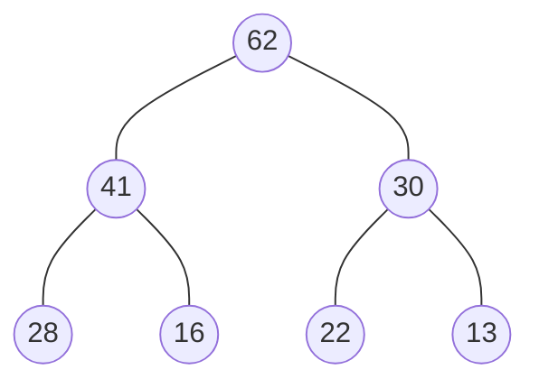

### 1. 背景
在开发中经常会遇到一类问题：当前任务执行完成，需要在待执行任务的队列中选取新的任务执行。最简单的做法是将所有任务按入队顺序排列，然后出队，即**先进先出的队列**。这种方法虽然简单，但效率较低，在需要优先级的问题中也不是最佳解法。

有很多时候我们需要从中选取最优的任务，这时我们可以为每个任务安排优先级，每次挑选任务选择优先级最高的任务出队，这种方法需要用到**优先级队列**。

比如在**A\*寻路**中，搜索到当前结点位，要从8个方向选取代价最小的位时，使用链表或数组存储需要我们遍历比较一次选取最小代价点位，而使用优先级可以避免遍历直接获得代价最小的点位搜索。

### 2. 优先级队列
跟普通队列相比，优先级队列出队顺序取决于优先级。优先级队列内部实现方式有很多，如：**有序数组、无序数组、堆**等。

1. 有序数组
入队时，对数组进行排序，因此时间复杂度为$O(n)$
出队时，选择优先级最高或最低的元素出队，时间复杂度为$O(1)$

2. 无序数组
入队时：直接将元素插入队尾，时间复杂度为$O(1)$
出队时：对数组进行排序，选出优先级最大或者最小的元素，时间复杂度为$O(n)$

无序数组可以看做是有序数组的惰性实现，需要出队时才对数组进行排序。

3. 堆
使用数据结构堆，可以提高优先级队列的性能。

### 3. 堆实现优先级队列
#### 3.1 堆的定义
一般情况下，堆指二叉堆，是一棵完全二叉树，堆具有如下性质：
1. **堆序性**：树中所有元素都小于（或大于）它的所有后裔，最小（或最大）的元素是根元素
2. 堆总是一棵**完全二叉树**，除了最底层，其他层结点都填满，最底层结点从左到右排布

例如以下大根堆：

用数组存储以上的堆结构：

|0|1|2|3|4|5|6|7|
|:--|:--|:--|:--|:--|:--|:--|:--|
|-|62|41|30|28|16|22|13|

可以发现，对于一个索引为$i$的节点，满足以下规律：
1. 父节点索引：$[i/2]$ （取整）
2. 左孩子结点索引：$2*i$
3. 右孩子结点索引：$2*i+1$

故可根据以上规律用数组描述堆的存储结构
![[Pasted image 20231212211021.png]]

#### 3.2 堆的数据结构
1. 堆内部可以用数组实现
```c
typedef struct{
	ElementType[] heap
}
```

2. 堆支持的基本操作

|操作|描述|时间复杂度|
|:--|:--|:--|
|build|采用罗伯特·弗洛伊德的方式建立堆|$O(n)$|
|push|向堆中插入新元素|$O(logn)$|
|heapify|从堆顶下沉更新使其符合堆序性|$O(logn)$|
|top|获取堆顶元素的值|$O(1)$|
|pop|删除堆顶元素|$O(logn)$|


3. 算法
- 插入元素$e$：在堆末尾建立空节点，假定其要容纳$e$，若满足堆序性则插入结束。否则，将父节点的元素装入空节点，删除父节点元素值，完成空节点上移，直到满足堆序性时将$e$装入空节点。
- 以小根堆为例：插入节点时，先在heap末尾添加元素，然后上浮检查堆序性：检查并比较当前节点与父节点的大小，若父节点的值更大，则当前节点的值改为父节点的值，然后当前节点指向父节点，继续比较直到到达满足堆序性的节点，最后将节点值指定为$e$
```
   void push(ElementType e)
1.  int i
2.  heap.push(e)
3.  for(i=heap.size()-1; heap[i/2]>e; i/=2)
4.    heap[i] = heap[i/2]
5.  end for
6.  heap[i] = e
```

- 删除堆顶元素：将根元素与堆中最后一个元素互换位置，然后删除最后一个元素，并堆根执行下沉操作，直到堆再次满足堆序性。（直接删除根结点合并两个堆操作比较繁琐）
- 以小根堆为例：执行下沉操作，从索引为1的根结点向下比较，获得当前节点$i$的左孩子$2*i$和右孩子$2*i+1$，选择较小的节点作为要交换的节点。如果选择的节点的值比当前节点的值小，则进行交换。
```
   void pop()
1.   if(heap.empty()) return
2.   heap[1] = heap[heap.size()-1]
3.   heap.pop()
4.   heapify()

   void heapify()
1.   int last_index = heap.size()-1
2.   int child_index
3.   for(int i=1; i*2<=last_index; i=child_index)
4.     child_index = i*2
5.     if(child_index<last_index && heap[child_index+1]<heap[child_index])
6.       ++child_index
7.     end if
8.     if(heap[i]>heap[child_index])
9.       swap(heap,i,child_index)
10.    end if
11.  end for 
```


#### 3.3 优先级队列的C++实现
1. 头文件定义
```cpp
// PriorityQueue.h
#include <vector>
class PriorityQueue {
public:
	PriorityQueue();
	~PriorityQueue();
	void push(int e);
	int top();
	void pop();
	bool empty();
	size_t size();	
	void display();
private:
	void heapify();
	void swap(int i, int j);
	std::vector<int> heap;
};
```

2. 函数体实现
```cpp
// PriorityQueue.cpp
#include "PriorityQueue.h"
PriorityQueue::PriorityQueue() {
	heap.emplace_back(INT_MIN);	
}
PriorityQueue::~PriorityQueue() {}
/*
上滤法向堆中插入元素
*/
void PriorityQueue::push(int e) {
	int i;
	heap.emplace_back(e);
	for (i = heap.size()-1; heap[i/2] > e; i /= 2) {		
		heap[i] = heap[i / 2];
	}
	heap[i] = e;
}
/*
返回堆顶元素，即索引为1的元素
*/
int PriorityQueue::top() {
	return heap[1];
}
/*
下滤法删除堆顶元素
*/
void PriorityQueue::pop() {
	if (empty()) {
		return;
	}
	heap[1] = heap[heap.size() - 1];
	heap.pop_back();
	heapify();
}
bool PriorityQueue::empty() {
	return heap.size() == 1;
}
size_t PriorityQueue::size() {
	return heap.size() - 1;
}
void PriorityQueue::swap(int i, int j) {
	int tmp = heap[i];
	heap[i] = heap[j];
	heap[j] = tmp;
}
void PriorityQueue::heapify() {	
	int last_index = heap.size() - 1;
	int child_index;
	for (int i = 1; i * 2 <= last_index; i = child_index) {		
		child_index = i * 2;		
		// 比较左右孩子
		if (child_index < last_index && heap[child_index + 1] < heap[child_index]) {
			++child_index;
		}
		if (heap[i] > heap[child_index]) {
			swap(i, child_index);
		}
	}
}
```

##### 参考
1. [优先级队列和堆（一） - 知乎 (zhihu.com)](https://zhuanlan.zhihu.com/p/355317948)
2. [【从堆的定义到优先队列、堆排序】 10分钟看懂必考的数据结构——堆_哔哩哔哩_bilibili](https://www.bilibili.com/video/BV1AF411G7cA/?spm_id_from=333.337.search-card.all.click)
3. [堆 - 维基百科，自由的百科全书 (wikipedia.org)](https://zh.wikipedia.org/wiki/%E5%A0%86%E7%A9%8D)
