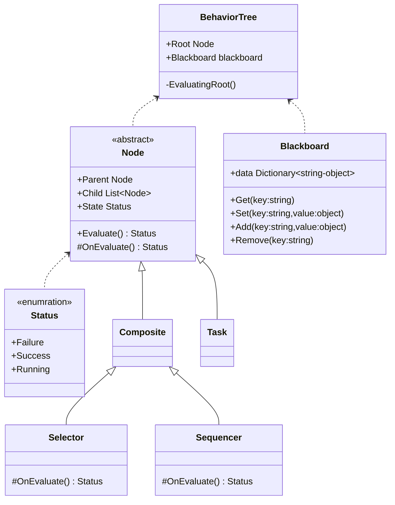

##### UML例图

```mermaid
classDiagram
Node<..Status
Node<|--Composite
Node<|--Task
Composite<|--Selector
Composite<|--Sequencer
BehaviorTree<..Node
BehaviorTree<..Blackboard

<<abstract>> Node
class Node{
	+Parent Node
	+Child List~Node~
	+State Status
	+Evaluate() Status
	#OnEvaluate() Status
}

class BehaviorTree{
	+Root Node
	+Blackboard blackboard
	-EvaluatingRoot()
}

class Blackboard{
	+data Dictionary~string-object~
	+Get(key:string)
	+Set(key:string,value:object)
	+Add(key:string,value:object)
	+Remove(key:string)
}

class Selector{
	#OnEvaluate() Status
}

class Sequencer{
	#OnEvaluate() Status
}

<<enumration>> Status
class Status{
	+Failure
	+Success
	+Running
}
```