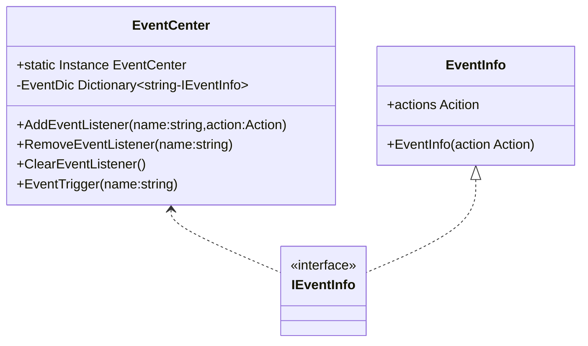

##### UML例图

```mermaid
classDiagram
EventCenter<..IEventInfo
EventInfo<|..IEventInfo

<<interface>> IEventInfo

class EventCenter{
	+static Instance EventCenter
	-EventDic Dictionary~string-IEventInfo~
	+AddEventListener(name:string,action:Action)
	+RemoveEventListener(name:string)
	+ClearEventListener()
	+EventTrigger(name:string)
}

class EventInfo{
	+actions Acition
	+EventInfo(action Action)
}
```

